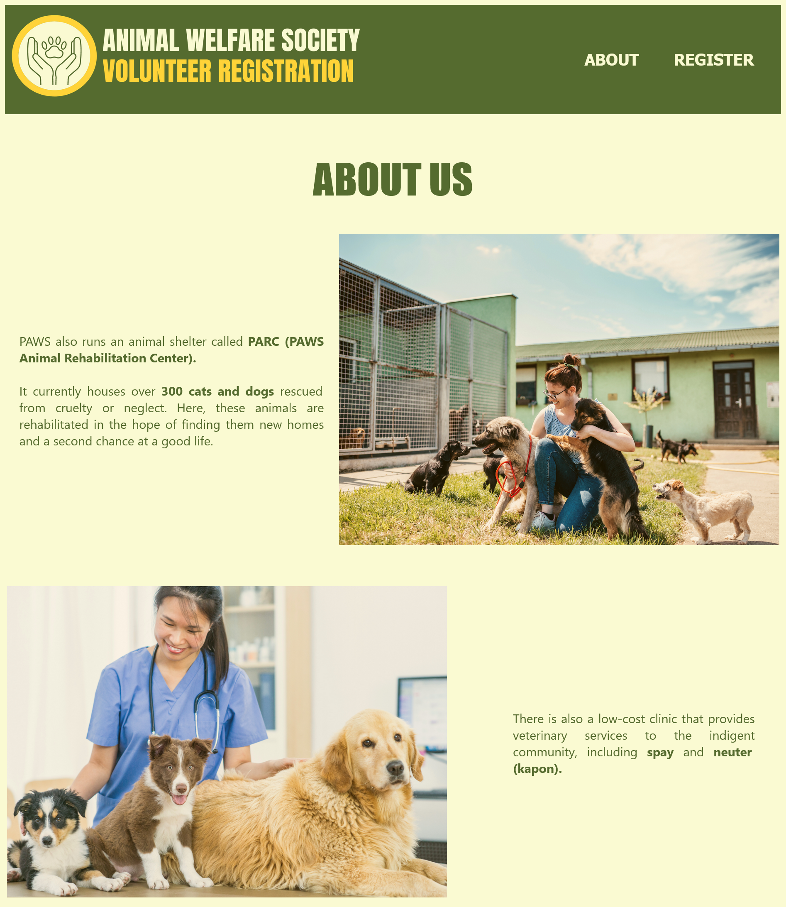
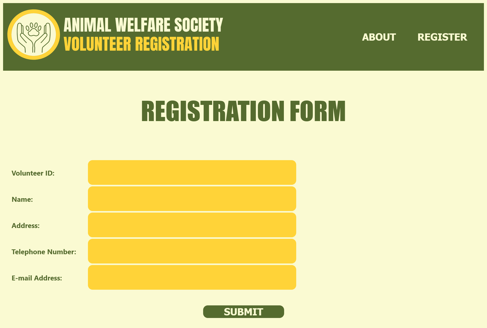
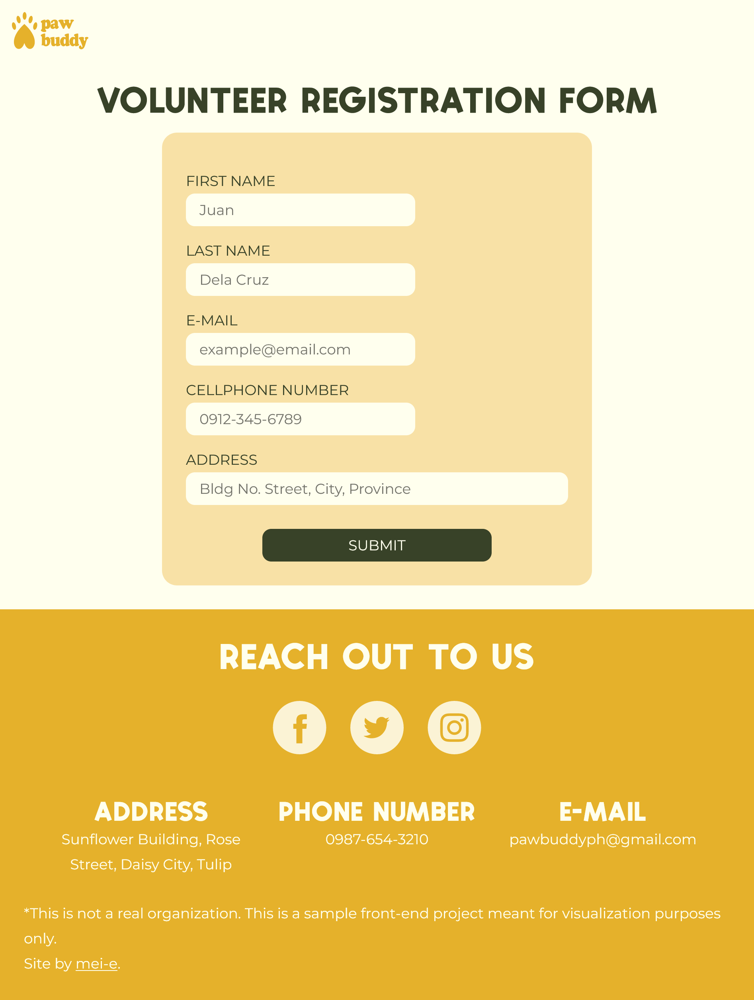

# Pawbuddy - Animal Shelter Volunteer Landing Page and Registration Form

## Project Description

Pawbuddy is a remake of my laboratory activity from my ***Web Systems and Technologies*** course during the third term of my second year BS Computer Science program.

The project was originally done with C# and ASP.NET Framework as it was the required programming language and framework for said course. CSS is also used for styling the website. 

As someone who was unfamiliar with the capabilities of CSS at the time, I find the UI of the website very poor-looking to my standards, as the color palette lack contrast and the layouts are not cohesive and responsive. Which is understandable at the time since the main focus is to build a fully functional website that has form validations.

With that being said, I decided to remake this project in order to practice my skills in HTML, SCSS/SaSS, Vanilla Javascript, and GSAP which can match the standards of building a UI-friendly, responsive, professional, and visually-appealing website. I also get to improve my design and organization skills in Figma.

## UI Concept

I envisioned **Pawbuddy** as a simple and friendly animal shelter. The original color palette does embody the said vibe with yellow and green being the main colors. However, it lacks contrast as the values of the hues clash with each other, especially with the light yellow colored background that prevents the main yellow hue to pop into the page.

Following the principles of design, I revised the color pallete to improve the contrast and harmony of every colors while sticking to the previous appearance of the page.

### Color palette
- Yellow: #E5B12B
- Green: #384228
- Warm white: #FFFFEE

I also improved the layouting of the page to provide visual balance to the site.

BEFORE:

AFTER (desktop view):

Figma project link [here.](https://www.figma.com/file/mU1K43SB6GIm2zDURCs462/Pawbuddy?node-id=0%3A1)

## Technologies Used  

- HTML5
- SCSS/SaSS 
- Vanilla Javascript
- GreenSock Animation Platform (GSAP)

## Development Process

I made the improved design first in Figma to provide a guide for myself while I layout the needed attributes in HTML.

While I started designing the desktop version first since the original project is only applicable for larger screens, I went with the ***mobile-first approach*** during coding.

A CSS pre-processor, SCSS or SaSS, is used for styling. Even though this can be done with just CSS, SaSS helps me create a more organized code thanks to its variables and nesting features.

After laying out and styling the website components, I used GSAP for the animations on the landing page and the modal.

Even though form validation can be done with just HTML, I used Vanilla Javascript to check if the input is empty and/or incorrect in order to prevent the modal from showing up once the submit button is clicked.

## Improvements and Future Plans

To make this project more dynamic, I plan to create a separate pages for each sections such as the about and the services provided. I might use React or Vue for this for a cleaner and more efficient code.

I also plan to connect the form to a database using PHP and MySQL to store input values. The data can be used in the landing page for displaying the amount of volunteers who signed up, which can bring more engagement to the site users (*e.g. Join 100 volunteers*).

*Will add content upon receiving more feedback*

## Assets Sources

- Fonts
    - Heading font: Patsy Sans by Vedran Vaskovic (downloaded from [Fontesk](https://fontesk.com/patsy-sans-font/)).
    
    - Body font: Montserrat by Julieta Ulanovsky, Sol Matas, Juan Pablo del Peral, and Jacques Le Bailly (embedded from [Google Fonts](https://fonts.google.com/)).

- Logo
    - Icon: made by me in Powerpoint
    - Font: QT Kooper by Qualitype (downloaded from [Fontesk](https://fontesk.com/kooper-font/)).

- Images: All downloaded from [Unsplash](https://unsplash.com/).

- Icons
    - Check icon in success modal downloaded from [Iconfinder](https://www.iconfinder.com/)     (color edited in Figma).
    - Close icon in success modal downloaded from EOS Icons Plugin in Figma.

- Graphics
    - Flower graphic on about section: Made by me in Powerpoint. Converted into SVG in Figma using the "Image Tracer" plugin by Dave Williames.

- Random text in about section from [RandomTextGenerator](https://randomtextgenerator.com/).